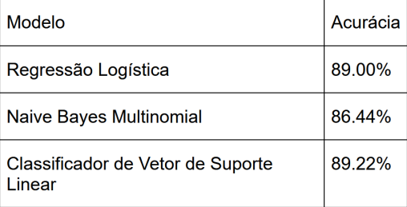

# ML - Aprendizado de Máquina
### (Machine Learning)

This repository contains the class exercise for Machine Learning. 

### **Projeto** 
Movie Review Sentiment Analysis 

This project uses the IMDB movie review dataset to create a sentiment analysis and machine learning model. The dataset consists of 25,000 highly polarized movie reviews, categorized as positive or negative.

#### Algorithms Used

- Logistic Regression  
- Multinomial Naive Bayes  
- Linear Support Vector Classifier

#### Results

#### Reference

This project is based on the tutorial from the following video: https://www.youtube.com/watch?v=yK9Ya6KzVAg&t=626s.
